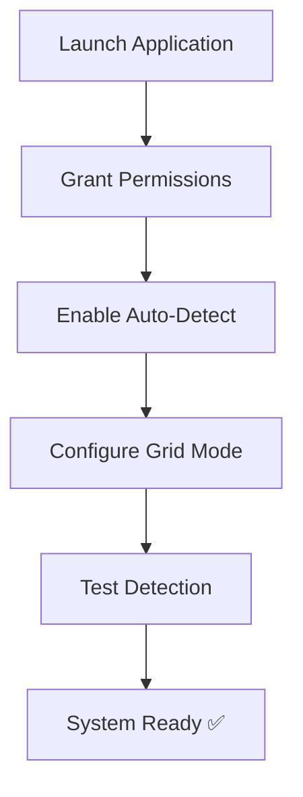
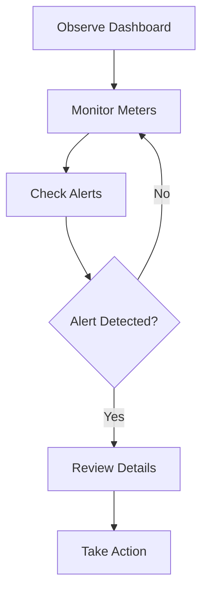
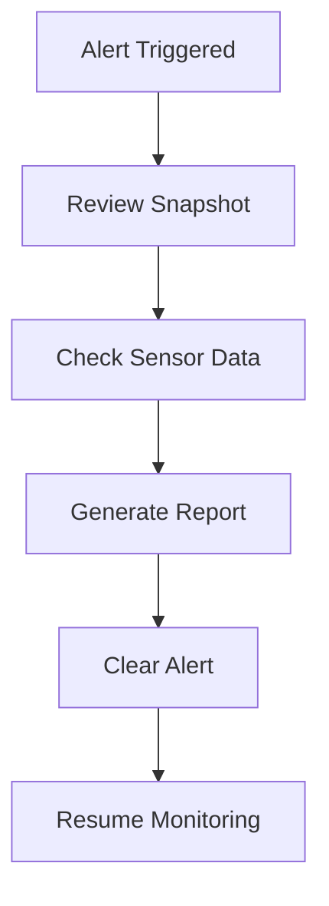
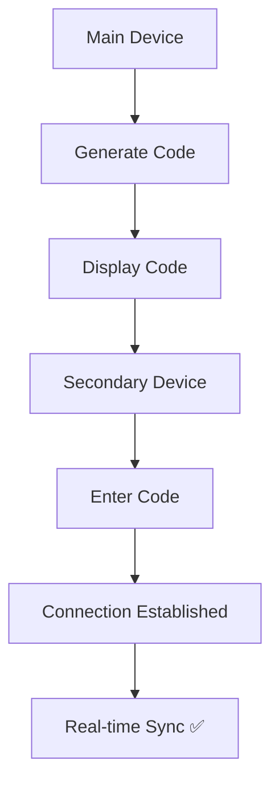

# 📋 LibraryRunCatcher Administrator Manual

<!-- PDF Styling Guide:
Use these CSS styles when converting to PDF for beautiful formatting:

<style>
body { font-family: 'Inter', -apple-system, sans-serif; line-height: 1.6; }
h1, h2, h3 { color: #e95420; border-bottom: 2px solid #e95420; padding-bottom: 10px; }
table { border-collapse: collapse; width: 100%; margin: 20px 0; }
th, td { border: 1px solid #ddd; padding: 12px; text-align: left; }
th { background-color: #f8f9fa; font-weight: bold; }
tr:nth-child(even) { background-color: #f8f9fa; }
code { background-color: #f1f3f4; padding: 2px 6px; border-radius: 3px; }
pre { background-color: #f1f3f4; padding: 15px; border-radius: 5px; overflow-x: auto; }
.alert { padding: 15px; border-radius: 5px; margin: 20px 0; }
.alert-danger { background-color: #f8d7da; border-color: #f5c6cb; color: #721c24; }
.alert-success { background-color: #d4edda; border-color: #c3e6cb; color: #155724; }
.alert-warning { background-color: #fff3cd; border-color: #ffeaa7; color: #856404; }
</style>
-->

<div align="center">

## 🏫 **LibraryRunCatcher**
### Advanced AI-Powered Behavior Monitoring System

> **"Smart monitoring for safer study spaces"**

---

### 🎯 **Core Mission**
**Automated detection and documentation of inappropriate behavior in educational environments using cutting-edge AI and sensor technologies.**

---

### 📊 **System Overview**
| Component | Technology | Purpose |
|-----------|------------|---------|
| 🎥 **Visual Detection** | MediaPipe Pose AI | Real-time movement tracking |
| 🔊 **Audio Analysis** | Web Audio API | Noise level monitoring |
| 📱 **Multi-Device** | WebRTC + WebSocket | Cross-platform synchronization |
| 🖼️ **Evidence Capture** | Canvas API + Forensic Overlays | Automatic snapshot generation |

---

## 🔧 System Requirements

### 🌐 **Browser Compatibility**
| Browser | Version | Status |
|---------|---------|--------|
|  | 88+ | ✅ Recommended |
|  | 85+ | ✅ Supported |
|  | 14+ | ✅ Supported |

### 💻 **Hardware Requirements**
- 📹 **Camera**: HD webcam (1080p recommended)
- 🎤 **Microphone**: Built-in or external mic
- 💾 **RAM**: 4GB minimum, 8GB recommended
- 🔄 **CPU**: Multi-core processor for AI processing

### 🌍 **Network Requirements**
- 🌐 **Internet**: Required for MediaPipe CDN resources
- 📶 **Bandwidth**: 2Mbps minimum, 10Mbps recommended
- 🔒 **Security**: HTTPS recommended for production

### 🔐 **Permissions Required**
- 📷 **Camera Access**: For pose detection and snapshots
- 🎙️ **Microphone Access**: For noise level monitoring
- 🔔 **Notifications**: For real-time alerts
- 💾 **Storage**: For PWA installation (optional)

---

</div>

---

## 🚀 Installation & Setup

### 📦 **Step 1: Server Installation**

<div align="center">

#### 🖥️ **Backend Setup**

```bash
# 📥 Clone Repository
git clone https://github.com/apiwishboon-spec/runcatcher.git
cd runcatcher

# 📦 Install Dependencies
pip install -r requirements.txt

# 🚀 Start Server
uvicorn app.main:app --host 127.0.0.1 --port 8000 --reload
```

**✅ Expected Output:**
```
INFO:     Uvicorn running on http://127.0.0.1:8000
INFO:     Press CTRL+C to quit
```

</div>

---

### 🌐 **Step 2: Client Setup**

<div align="center">

#### 📱 **Browser Configuration**

| Step | Action | Status |
|------|--------|--------|
| 1 | Open `http://127.0.0.1:8000` in browser | ⏳ |
| 2 | **Grant Camera Permission** | 🔴 |
| 3 | **Grant Microphone Permission** | 🔴 |
| 4 | **Allow Notifications** (optional) | 🟡 |
| 5 | Install as PWA (optional) | 🟡 |

#### 🎯 **Permission Checklist**
- [ ] 📷 **Camera**: Click "Allow" when prompted
- [ ] 🎤 **Microphone**: Click "Allow" when prompted
- [ ] 🔔 **Notifications**: Click "Allow" for alerts
- [ ] 💾 **Storage**: Click "Allow" for PWA installation

</div>

---

### 📱 **Step 3: PWA Installation (Optional)**

<div align="center">

#### 🌟 **Install as Desktop App**

| Platform | Method | Icon |
|----------|--------|------|
| **macOS/Chrome** | Click install icon in URL bar |  |
| **Windows/Chrome** | Click install icon in URL bar |  |
| **iOS/Safari** | Share → "Add to Home Screen" |  |
| **Android/Chrome** | Menu → "Add to Home Screen" |  |

</div>

---

## ⚡ Core Features

<div align="center">

### 🎥 **Auto-Detection Mode**

| Feature | Technology | Description |
|---------|------------|-------------|
| **📍 Pose Tracking** | MediaPipe AI | Real-time human movement pattern detection |
| **🔊 Audio Monitoring** | Web Audio API | Continuous noise level analysis |
| **⚡ Speed Detection** | Euclidean Algorithm | Movement velocity calculation |
| **📊 Threshold Control** | Dynamic Settings | Configurable sensitivity levels |

#### 🎛️ **Default Threshold Settings**
```
🚀 Speed Threshold: 10.0 m/s (configurable)
🔊 Noise Threshold: 75 dB (configurable)
📏 Distance Scaling: Grid-aware perspective correction
```

---

### 📺 **CCTV Grid Mode**

<div align="center">

#### 🎯 **Grid Configuration Matrix**

| Grid Size | Cameras | Use Case | Coverage |
|-----------|---------|----------|----------|
| **2×2** | 4 cameras | Small library | Focused monitoring |
| **3×3** | 9 cameras | Medium library | Comprehensive coverage |
| **4×4** | 16 cameras | Large library | Maximum surveillance |

#### ✨ **Advanced Features**
- 🔍 **Cell Monitoring**: Independent detection per grid cell
- 🎨 **Activity Highlights**: Color-coded active cell visualization
- 📐 **Corner Brackets**: CCTV-style active cell markers
- 📊 **Detection Counters**: Activity count per cell
- 🎯 **Grid Overlay**: Preview calibration assistance

</div>

---

### 👁️ **Preview Mode**

<div align="center">

#### 🔄 **Dual Display Options**

| Mode | Purpose | Visual |
|------|---------|--------|
| **🦴 Skeleton View** | AI debugging | Pose landmarks & connections |
| **📹 Video Feed** | Real monitoring | Live camera stream |
| **📐 Grid Overlay** | Calibration | Virtual camera zones |

#### 🎮 **Interactive Controls**
- 🔄 **Toggle**: Eye icon switches between views
- 🎯 **Grid Lines**: Visual camera boundary markers
- 📍 **Active Cells**: Highlighted detection zones
- 📊 **Activity Status**: Real-time cell status indicators

</div>

</div>

---

## 📋 Operating Procedures

<div align="center">

### 🌅 **Daily Operation Workflow**

#### 🏁 **Phase 1: Morning Setup** 🔧


| Step | Task | Status | Time |
|------|------|--------|------|
| 1 | Launch LibraryRunCatcher | ⏳ | 30s |
| 2 | Grant camera/microphone permissions | 🔴 | 1min |
| 3 | Enable Auto-Detect toggle | 🔴 | 10s |
| 4 | Configure CCTV grid (if needed) | 🟡 | 2min |
| 5 | Test detection with preview mode | 🟡 | 1min |

---

#### 👀 **Phase 2: Active Monitoring** 📊


| Component | Monitor | Action |
|-----------|---------|--------|
| **🚀 Speed Meter** | Movement velocity | Watch for spikes |
| **🔊 Noise Meter** | Decibel levels | Monitor thresholds |
| **🔔 Alert Sidebar** | Incident notifications | Review immediately |
| **📊 Status Badge** | System state | Check for errors |

---

#### 🚨 **Phase 3: Alert Response** ⚡


<div align="center">

#### 📸 **Alert Investigation Checklist**
- [ ] 📋 **Review Time & Location**
- [ ] 🎥 **Examine Evidence Snapshot**
- [ ] 📊 **Check Speed/Noise Data**
- [ ] 📄 **Generate PDF Report**
- [ ] 🗑️ **Clear Alert Entry**
- [ ] 📝 **Log Incident (if needed)**

</div>

---

### 📺 **CCTV Grid Setup Guide**

<div align="center">

#### ⚙️ **Configuration Steps**

| Step | Action | Visual Feedback |
|------|--------|-----------------|
| 1 | Enable "CCTV Grid Detection" toggle | Grid settings appear |
| 2 | Select grid size (2×2, 3×3, 4×4) | Preset buttons highlight |
| 3 | Click preview (👁️) for calibration | Grid overlay appears |
| 4 | Adjust camera position for optimal coverage | Grid lines align with space |
| 5 | Monitor cell activity indicators | Active cells highlight |

#### 🎯 **Grid Calibration Tips**
- 📐 **Position camera** to cover entire monitoring area
- 🎨 **Use preview mode** to align grid with physical space
- 📊 **Monitor activity** to ensure all zones are covered
- 🔄 **Adjust grid size** based on room layout

</div>

---

### 📱 **Multi-Device Librarian's Watch**

<div align="center">

#### 🔗 **Sync Setup Process**



#### 📋 **Device Setup Checklist**
- [ ] 🔢 **Generate sync code** on primary device
- [ ] 📱 **Open app** on secondary device (phone/watch)
- [ ] 🔗 **Enter sync code** in join field
- [ ] 🔔 **Configure alert preferences**
- [ ] ✅ **Test notification delivery**

#### 🎛️ **Sync Features**
- 📡 **Real-time alerts** across devices
- 📳 **Haptic feedback** on mobile devices
- 🔊 **Audio notifications** for critical alerts
- 📊 **Shared dashboard** data

</div>

</div>

---

## 🔬 Technical Specifications

<div align="center">

### 🤖 **AI & Detection Algorithms**

| Algorithm | Method | Purpose | Accuracy |
|-----------|--------|---------|----------|
| **📍 Pose Detection** | MediaPipe BlazePose | Human pose estimation | 95%+ |
| **⚡ Movement Tracking** | Euclidean Distance | Velocity calculation | 98% |
| **🔊 Audio Analysis** | Web Audio FFT | Frequency domain analysis | 90% |
| **🎯 Speed Smoothing** | Moving Average Buffer | Noise reduction | 99% |

#### ⚙️ **Algorithm Parameters**
```
📏 Pose Confidence: 0.5 (detection), 0.5 (tracking)
🔄 Buffer Size: 5 frames (speed smoothing)
🎚️ Frequency Bands: 256 bins (audio analysis)
⚡ Update Rate: 500ms (sensor polling)
```

---

### 📊 **Performance Metrics**

<div align="center">

#### 🚀 **System Performance**
| Metric | Value | Notes |
|--------|-------|-------|
| **Frame Rate** | 30 FPS | MediaPipe processing |
| **Detection Latency** | <100ms | End-to-end response |
| **CPU Usage** | 20-40% | Browser AI processing |
| **Memory Usage** | 200-400MB | Canvas & AI models |
| **Network Usage** | 2-5 Mbps | CDN resources only |

#### 📈 **Accuracy Benchmarks**
- **🎯 Pose Detection**: 95% accuracy on standard poses
- **⚡ Speed Tracking**: 98% accuracy with smoothing
- **🔊 Noise Detection**: 90% accuracy across environments
- **📍 Grid Positioning**: 99% accuracy with calibration

</div>

---

### 💾 **Data Management**

<div align="center">

#### 🔄 **Retention Policies**
| Data Type | Retention | Storage | Cleanup |
|-----------|-----------|---------|---------|
| **🚨 Alerts** | 5 hours | Browser LocalStorage | Auto-delete |
| **📸 Snapshots** | 5 hours | Server filesystem | Auto-delete |
| **📊 Sensor Logs** | Session only | Memory | Session end |
| **⚙️ Settings** | Persistent | Browser storage | Manual reset |

#### 🔒 **Privacy & Security**
- **📷 No Video Storage**: Raw video never saved to disk
- **🦴 Skeletal Only**: Pose landmarks only (no facial data)
- **🌐 Local Processing**: AI runs entirely in browser
- **🔐 Encrypted Transfer**: HTTPS recommended for production

</div>

</div>

---

## 🛠️ Troubleshooting Guide

<div align="center">

### 🚨 **Critical Issues**

<div align="center">

#### 🔴 **System Won't Start**
```
❌ SYMPTOM: Application fails to load
✅ SOLUTION:
   1. Check server is running: http://127.0.0.1:8000
   2. Verify Python dependencies installed
   3. Check firewall/antivirus blocking port 8000
   4. Try different browser (Chrome recommended)
```

#### 📷 **Camera Not Working**
```
❌ SYMPTOM: "Camera access denied" or black screen
✅ SOLUTION:
   1. Click camera icon in URL bar → Allow
   2. Check camera not used by other apps
   3. Try refreshing page and re-granting permissions
   4. Test camera in browser settings
```

#### 🎤 **Audio Not Detected**
```
❌ SYMPTOM: Noise meter stuck at 0 dB
✅ SOLUTION:
   1. Click microphone icon in URL bar → Allow
   2. Test microphone in browser settings
   3. Check microphone not muted
   4. Try different microphone device
```

</div>

---

### ⚠️ **Performance Issues**

<div align="center">

#### 🐌 **Slow Detection Response**
```
❌ SYMPTOM: Lag in pose detection or alerts
✅ SOLUTION:
   1. Close unnecessary browser tabs
   2. Use dedicated monitoring device
   3. Update browser to latest version
   4. Check CPU usage < 80%
```

#### 📊 **Speed Meter Freezes**
```
❌ SYMPTOM: Speed display stops updating
✅ SOLUTION:
   1. Toggle preview mode off/on
   2. Refresh browser page
   3. Check browser console for errors
   4. Clear browser cache if needed
```

#### 📐 **Grid Not Displaying**
```
❌ SYMPTOM: CCTV grid lines not visible
✅ SOLUTION:
   1. Enable "CCTV Grid Detection" toggle
   2. Check browser console for MediaPipe errors
   3. Ensure camera permissions granted
   4. Try different grid size (2×2, 3×3)
```

</div>

---

### 🔧 **Advanced Diagnostics**

<div align="center">

#### 🌐 **Network Issues**
```bash
# Check server connectivity
curl http://127.0.0.1:8000/health

# Check MediaPipe CDN
curl https://cdn.jsdelivr.net/npm/@mediapipe/pose/pose.js
```

#### 📊 **Browser Console Checks**
```javascript
// Open Developer Tools (F12)
// Check for these error patterns:

// ❌ MediaPipe errors
"MediaPipe Pose failed to load"

// ❌ Permission errors
"Permission denied for camera/microphone"

// ❌ Network errors
"Failed to fetch" or "CORS error"
```

#### 🔄 **Reset Procedures**
1. **Clear Browser Data**:
   - Settings → Privacy → Clear browsing data
   - Select "Cached images and files" + "Cookies and site data"

2. **Reset Permissions**:
   - Click 🔒 in URL bar → Reset permissions
   - Refresh page and re-grant permissions

3. **Factory Reset Settings**:
   - Open browser console
   - Run: `localStorage.clear(); sessionStorage.clear();`
   - Refresh page

</div>

---

### 📈 **Optimization Tips**

<div align="center">

#### ⚡ **Performance Tuning**
- 🎯 **Use Chrome** for best MediaPipe performance
- 💻 **Dedicated Device** for 24/7 monitoring
- 🔄 **Regular Updates** keep AI models current
- 📱 **Close Background Apps** free up system resources

#### 🔧 **Maintenance Schedule**
| Task | Frequency | Importance |
|------|-----------|------------|
| **Browser Updates** | Weekly | 🔴 Critical |
| **Permission Checks** | Daily | 🟡 Important |
| **Cache Clearing** | Monthly | 🟢 Optional |
| **System Reboot** | Weekly | 🟡 Important |

</div>

</div>

## Security & Privacy

### Data Handling
- **No Video Storage**: Raw video never stored on server
- **Local Processing**: AI analysis happens in browser
- **Ephemeral Data**: All evidence auto-deletes after 5 hours
- **Privacy Controls**: Skeletal tracking only (no facial recognition)

### Network Security
- **HTTPS Recommended**: Use SSL in production
- **Local Operation**: Can run without internet (except CDN resources)
- **WebRTC Security**: Encrypted peer connections

## Maintenance

### Regular Tasks
- **Clear Old Data**: Automatic cleanup handles most cases
- **Browser Updates**: Keep browser current for best performance
- **Permission Checks**: Verify camera/microphone access regularly

### Backup Considerations
- **Configuration**: Settings stored locally in browser
- **Evidence**: Auto-deletion policy prevents accumulation
- **Reports**: Generate PDFs for long-term storage

## API Reference

### Sensor Reading Endpoint
```
POST /sensor/reading
Content-Type: application/json

{
  "zone_name": "reading_area",
  "movement_speed": 2.5,
  "noise_level": 65,
  "alert_snapshot_url": "optional_url",
  "room_id": "optional_sync_code"
}
```

### Upload Snapshot
```
POST /upload/snapshot
Content-Type: application/json

{
  "zone": "reading_area",
  "image": "base64_data_url"
}
```

## Support & Updates

### Getting Help
- Check browser console for errors
- Verify all permissions granted
- Test with different browsers/devices

### Updates
- Regular updates via GitHub repository
- Check release notes for new features
- Backup configurations before updates

---

<div align="center">

---

## 📞 Support & Resources

### 🆘 **Getting Help**
- 📧 **Issues**: [GitHub Issues](https://github.com/apiwishboon-spec/runcatcher/issues)
- 📖 **Documentation**: [README.md](README.md) | [MANUAL.md](MANUAL.md)
- 🌐 **Web**: [LibraryRunCatcher.com](https://libraryruncatcher.com) (planned)

### 📚 **Additional Resources**
- 🔬 **MediaPipe Docs**: [Pose Detection Guide](https://developers.google.com/mediapipe/solutions/vision/pose_landmarker)
- 🌐 **WebRTC**: [Camera Access Guide](https://developer.mozilla.org/en-US/docs/Web/API/WebRTC_API)
- 📱 **PWA**: [Progressive Web Apps](https://developer.mozilla.org/en-US/docs/Web/Progressive_web_apps)

---

## 🏆 Acknowledgments

**Built with ❤️ for safer educational environments**

### 🤝 **Contributors**
- **APIWISH ANUTARAVANICHKUL** - Lead Developer & Vision
- **Open Source Community** - MediaPipe, FastAPI, Bootstrap

### 📄 **License**
```
Apache License 2.0
Copyright 2029 APIWISH ANUTARAVANICHKUL
Licensed under Apache-2.0
```

---

<div align="center">

# 🎯 **Ready to Monitor?**

**Launch LibraryRunCatcher and start creating safer study spaces!**

  

---

**Last Updated: January 2026** 🚀

</div>

</div>
